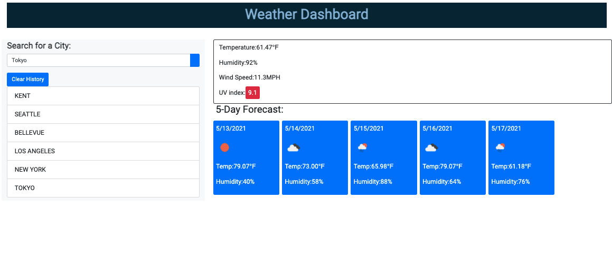

# Weather-Dashboard

<h2>Description</h2>

*   I developed a weather dashboard for any person to be able to see the weather outlook for any given day and for multiple cities. The user may be traveling and needs to know what the forecast will be like to plan accordingly. The user can access the 5-day forecast for a specific city, which also includes important data such as the temperature, humidity, wind speed, and the UV index. 

* Weather conditions are represented with icons and colors that represent the conditions of the weather as favorable, moderate, or severe. 

* All previously searched cities are stored locally and are accessible even after refreshing the page. The user can clear the previously searches cities by clicking the "Clear History" button.

<h2>Links</h2>

* Check out the deployed project @ https://tylerhance.github.io/weather-dashboard/

